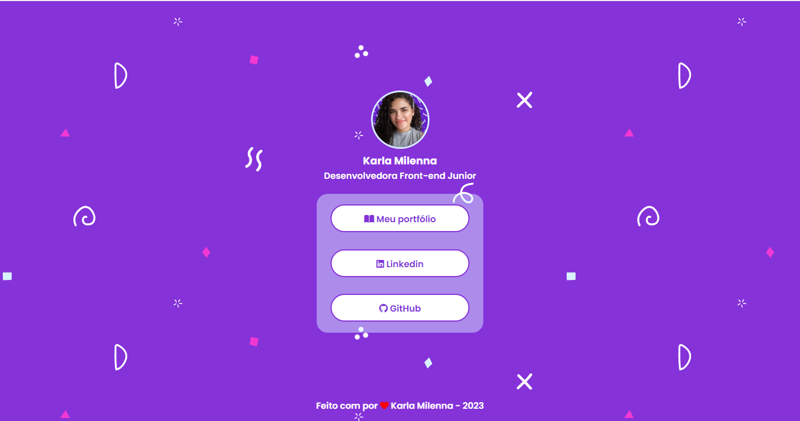

<h1 align="center"> 👩‍💻 Projeto - My Links 🔗</h1>

<h3 align="center"> 
	Projeto concluído ✅
</h3>

<h2>💻 Sobre o projeto</h2>

Um página com links para as minhas redes inspirada no linktree.
 

<h3><strong><a href="https://kamilenna.github.io/my-links/" target="_blank">Link do projeto</a></strong></h3>

 

<h2>🎨 Layout</h2>

<h3><strong><a href="https://www.figma.com/file/zlWwQ7mD2VjmFFEVJ3JSfy/dev-links?node-id=0%3A1&t=9THyzI6IRbPWVJ2d-1" target="_blank">Link do Figma</a></strong></h3>

 

<h2>🛠 Tecnologias</h2>
<ul>
    <li><a href="https://developer.mozilla.org/pt-BR/docs/Web/HTML">HTML</a></li>
    <li><a href="https://developer.mozilla.org/pt-BR/docs/Web/CSS">CSS</a></li>
    <li><a href="https://fontawesome.com/">Font Awesome</a></li>
    <li><a href="https://www.svgbackgrounds.com/set/free-svg-backgrounds-and-patterns/" target="_blank">SVG Backgrounds</a></li>
</ul>

 

<h2>🦸 Autor(a)</h2>
<a href="https://karlamilenna.netlify.app/" target="_blank">
 
  
 <h3><b>Karla Milenna</b></h3></a>